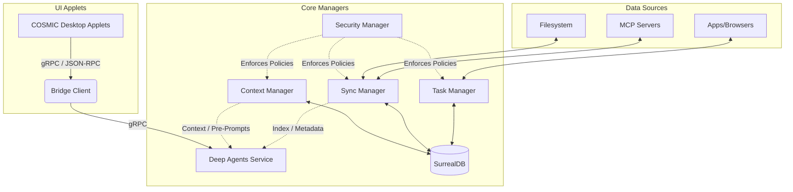

# Atom OS Architecture

Atom OS is built around a set of core Rust managers that intercommunicate via standard mechanisms (such as gRPC) and store state in [SurrealDB](https://surrealdb.com/). It deeply integrates intelligent operations, such as RAG (Retrieval-Augmented Generation), workflows, and agents, into the desktop environment using the COSMIC desktop toolkit.

## System Diagram

## Core Components

- **SurrealDB:** The persistent bedrock of Atom OS. It stores filesystem sync records, conversation history, task state, discovered contexts, and schema metadata.
- **Sync Manager:** Connects local data (like the filesystem using CocoIndex) and MCP (Model Context Protocol) servers into the database. It handles incremental updates and embeddings.
- **Context Manager:** Automatically discovers personal and work projects, clusters information using RAG, and generates summaries and pre-prompts for AI agents.
- **Task Manager:** A workflow engine with scheduling capabilities and a multi-agent orchestration layer that executes user-defined or autonomous tasks.
- **Security Manager:** Manages system-level security—from certificate rotations and Kata Container sandboxing to whitelisting specific agent tool requests.
- **Bridge (Rust & Python):** A gRPC-based bridge connecting the Rust system components to a powerful LangChain-based Python agent framework.
